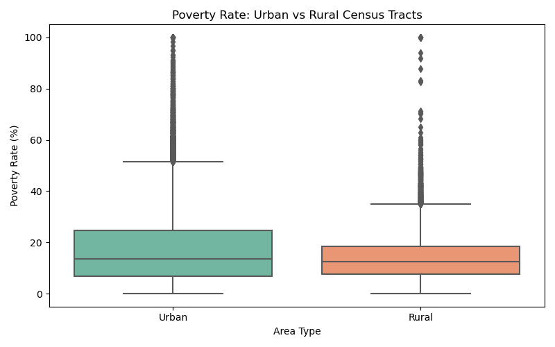
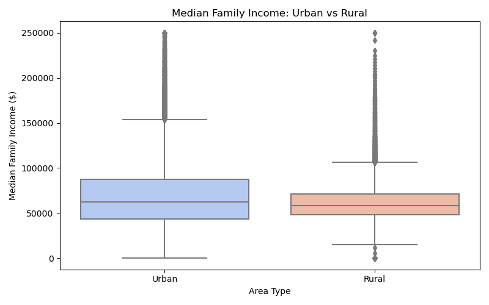
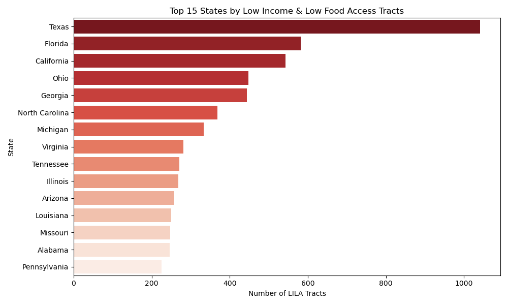
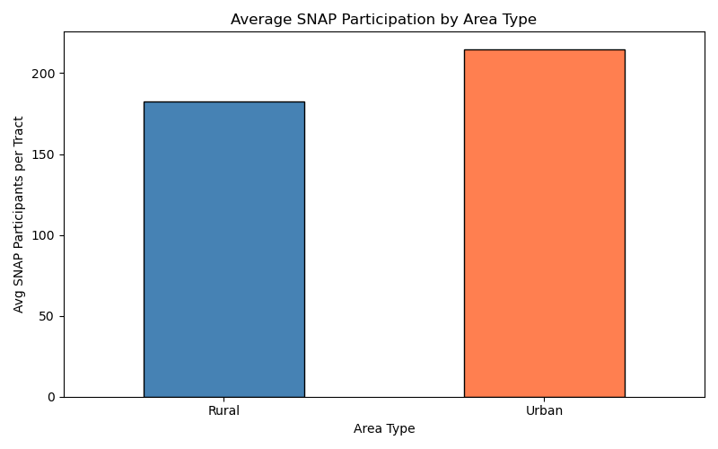
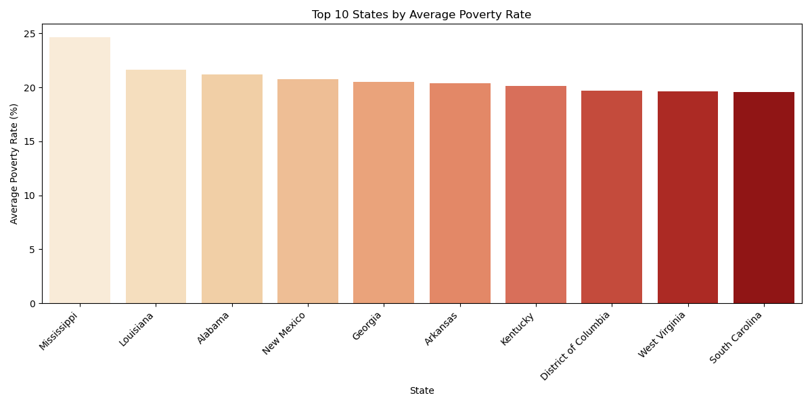

# 🌽 Food Market Price Disparity & Access Analysis

## Problem Statement
Food access disparities across urban and rural communities remain a critical public health and economic challenge in the United States. This project analyzes USDA Food Access Research Atlas data to identify regional food access gaps, low-income low-access (LILA) tracts, and poverty-driven supply-demand imbalances across counties and states.

## Tools & Technologies
- **Python** (Pandas, NumPy, Matplotlib, Seaborn, Folium)
- **Dataset:** USDA Food Access Research Atlas — [Kaggle Link](https://www.kaggle.com/datasets/tcrammond/food-access-and-food-deserts)

## 📁 Project Structure
```
food-market-price-analysis/
│
├── data/
│   ├── food_access_research_atlas.csv     # Main dataset
│   └── food_access_variable_lookup.csv    # Variable descriptions
│
├── notebooks/
│   └── food_access_analysis.py            # Main analysis script
│
├── visuals/
│   └── *.png                              # Generated charts
│
└── README.md
```

## Key Analysis Areas
- Poverty rate and median family income disparities across urban vs rural tracts
- Top states by low income & low food access (LILA) tracts
- SNAP participation patterns by area type
- Regional food access gaps across 50 states

## Visualizations






## How to Run
```bash
git clone https://github.com/itsswatii/food-market-price-analysis.git
cd food-market-price-analysis
pip install pandas numpy matplotlib seaborn folium
python notebooks/food_access_analysis.py
```

## Results & Insights
> To be updated after analysis completion.

